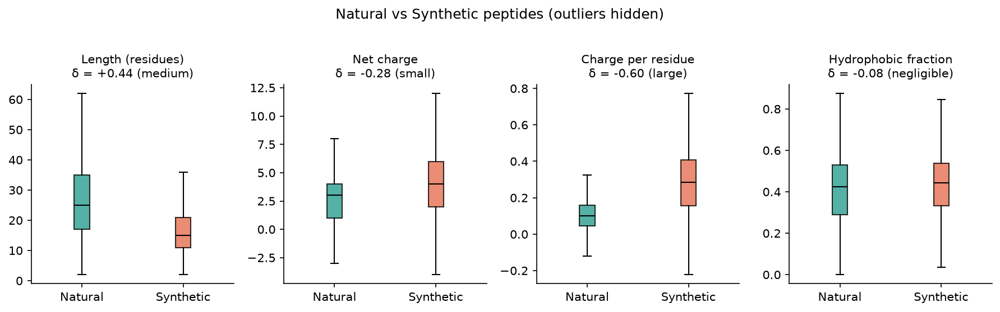
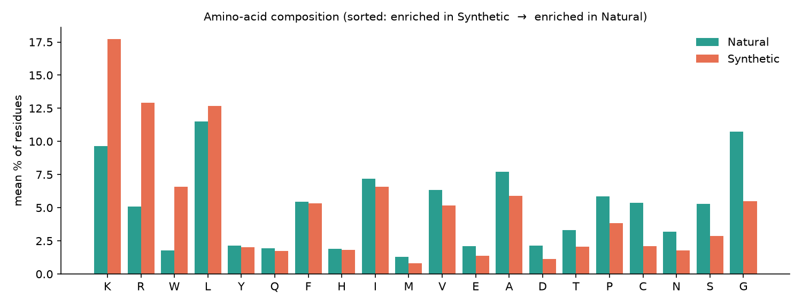
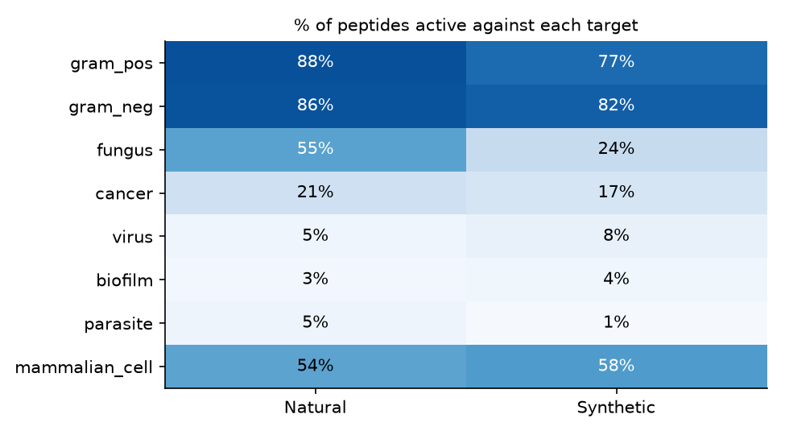
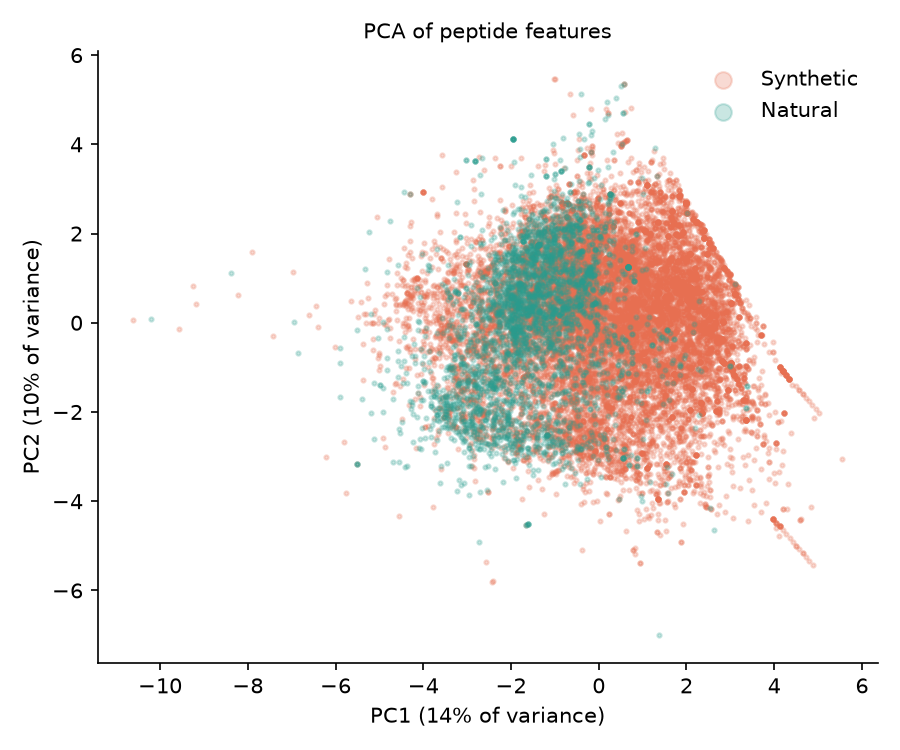
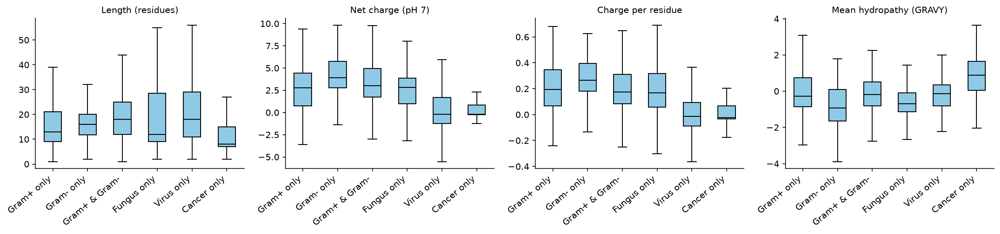
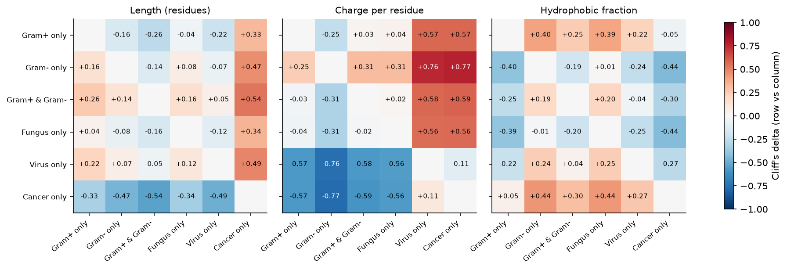
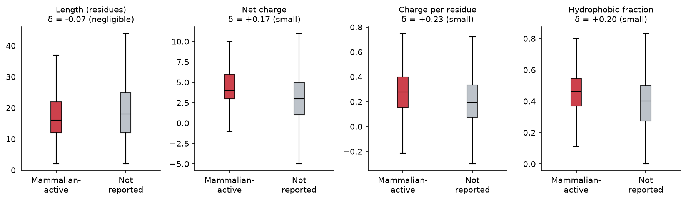

# DBAASP comparative study: what makes antimicrobial peptides differ?

A small, beginner-level comparative study of antimicrobial peptides from the DBAASP database. It asks whether simple features of a peptide (length, charge, hydrophobicity, amino-acid makeup) differ between groups of peptides.

## Questions

1. **Q1 – Natural vs Synthetic:** how do they differ in length, charge and amino-acid composition?
2. **Q2 – Targets:** how do peptides that act on different organisms (Gram+, Gram-, fungi, virus, cancer) differ?
3. **Q3 – Mammalian cells:** do peptides active on mammalian cells (cytotoxic) look different from the rest?

## The data

The `by_*/` folders and `manifest.csv` are slices of **one master table** of about 25,500 peptide records (`dbaasp_datasets_corrected.zip` holds the same files). The slices overlap, so they are not independent datasets. `by_origin/` (Natural + Synthetic) covers every peptide exactly once, so the analysis is built from it.

## Repository layout

| Path | What it holds |
|---|---|
| `by_origin/`, `by_domain/`, `by_kingdom/`, `by_length_class/`, `by_target_group/`, `by_target_object/` | raw slices of the master table |
| `notebooks/01_clean.ipynb` | cleaning: raw table → one clean table |
| `notebooks/02_features.ipynb` | per-peptide features |
| `notebooks/03_compare.ipynb` | statistical comparison, figures, findings |
| `results/` | `clean_peptides.csv`, `peptide_features.csv`, `cleaning_log.csv`, and the `comparison_*.csv` tables |
| `figures/` | all figures used below |

To reproduce (Python 3, `pip install -r requirements.txt`), run the notebooks in order, each from inside the `notebooks/` folder:

```bash
cd notebooks
jupyter nbconvert --to notebook --execute --inplace 01_clean.ipynb 02_features.ipynb 03_compare.ipynb
```

## Method

**Cleaning** (`01_clean.ipynb`) – 25,542 raw rows become 18,196 peptides:

| Step | Rows left | Removed |
|---|---|---|
| Raw (Natural + Synthetic) | 25,542 | – |
| Drop exact duplicate rows | 23,542 | 2,000 |
| Keep monomers only (multimers hold several sequences per row) | 22,907 | 635 |
| Drop sequences with `X` (unknown residue) | 18,275 | 4,632 |
| Drop length < 2 | 18,196 | 79 |

The final table has 3,239 natural and 14,957 synthetic peptides. Lower-case (D-amino acid) letters were converted to upper case, with a `has_D_aa` flag kept.

**Features** (`02_features.ipynb`) – length; net charge = (K + R) − (D + E); charge per residue (net charge ÷ length); hydrophobic fraction (share of A, V, L, I, M, F, W); and the percentage of each of the 20 amino acids.

**Statistics** (`03_compare.ipynb`) – the features are not normally distributed, so rank-based tests are used: Mann-Whitney U for two groups, Kruskal-Wallis for more than two. With thousands of peptides almost every p-value is tiny, so the results are judged by an **effect size, Cliff's delta (δ)**: 0 means no difference, ±1 means the groups do not overlap. Rough labels: |δ| < 0.15 negligible, < 0.33 small, < 0.47 medium, otherwise large. Bonferroni correction is used for the 20 amino-acid tests and the pairwise group comparisons.

For Q2, target groups overlap (one peptide can hit Gram+, Gram- and fungi), so only peptides whose targets are *exactly* one of six sets are used: Gram+ only, Gram- only, Gram+ & Gram-, Fungus only, Virus only, Cancer only.

## Results

### Q1 – Natural vs Synthetic

| Feature | Natural (median) | Synthetic (median) | δ | Effect |
|---|---|---|---|---|
| Length (residues) | 25 | 15 | +0.44 | medium |
| Net charge | 3 | 4 | −0.28 | small |
| **Charge per residue** | 0.10 | 0.29 | **−0.60** | **large** |
| Hydrophobic fraction | 0.43 | 0.44 | −0.08 | negligible |



* **Charge per residue is the clearest difference**, and it holds when only short (10–24 aa) peptides are compared (δ = −0.66) or when peptides with D-amino acids are removed (δ = −0.58).
* **Hydrophobic fraction is not a stable difference.** It is almost identical overall, but among short peptides the direction flips (natural more hydrophobic, δ = +0.19). Interpret it with care because the two groups differ in length.
* **Composition:** synthetic peptides are richer in K (mean 17.7% vs 9.7%), R (12.9% vs 5.1%) and W (6.6% vs 1.8%). Natural peptides are richer in G (10.7% vs 5.5%, the only medium effect) and, to a smaller degree, S, N, C, P, T and A.



* **Targets:** natural peptides are reported active against fungi much more often (55% vs 24%) and against parasites (4.7% vs 1.2%); Gram+ activity is 88% vs 77%.



* **PCA:** the two groups overlap heavily (PC1 and PC2 explain 14% and 10% of the variance). Synthetic peptides sit further along PC1, which is driven mainly by charge, but these features do not separate the groups cleanly.



### Q2 – Peptides with different targets

| Group | n | Median length | Median net charge | Median charge per residue | Median hydrophobic fraction |
|---|---|---|---|---|---|
| Gram+ only | 709 | 15 | 3 | 0.17 | 0.45 |
| Gram- only | 692 | 18 | 5 | 0.28 | 0.31 |
| Gram+ & Gram- | 2,788 | 18 | 4 | 0.20 | 0.42 |
| Fungus only | 324 | 16 | 3 | 0.14 | 0.31 |
| Virus only | 750 | 20 | 0 | 0.00 | 0.40 |
| Cancer only | 144 | 8 | 0 | 0.00 | 0.50 |



* The groups differ mainly in **charge** (Kruskal-Wallis effect size ε² ≈ 0.18 for net charge and charge per residue, against 0.03 for length and 0.05 for hydrophobic fraction).
* Virus-only and Cancer-only peptides have median net charge 0, against 3–5 for the antibacterial and antifungal groups (charge δ between +0.5 and +0.8).
* Gram- only peptides have the highest charge per residue; with Fungus-only they also have the lowest hydrophobic fraction.
* **Check:** the origin mix differs by group (Virus-only is 1% natural, Cancer-only 49%). Repeating the medians for synthetic peptides only gives the same picture, so this is not just an origin effect.



### Q3 – Mammalian-cell activity

`is_mammalian_cell = 1` means DBAASP lists mammalian cells among the peptide's targets (10,305 peptides); the rest are "not reported" (7,600).

| Feature | Mammalian-active | Not reported | δ | Effect |
|---|---|---|---|---|
| Length | 16 | 18 | −0.07 | negligible |
| Net charge | 4 | 3 | +0.18 | small |
| Charge per residue | 0.28 | 0.19 | +0.23 | small |
| Hydrophobic fraction | 0.46 | 0.40 | +0.20 | small |



Mammalian-active peptides are somewhat more charged and hydrophobic. The same small effects appear within synthetic peptides and within natural peptides separately. The overlap is large, so these features alone would not predict mammalian activity well.

## Limitations

* The peptides are not a random sample of all peptides; they are the ones researchers chose to test and report in DBAASP. Synthetic peptides outnumber natural ones about 5 to 1.
* About 20% of monomer sequences were dropped for containing `X`; the rate was similar for both origins (19% natural, 21% synthetic).
* Q2 keeps only peptides with exactly one target set, which leaves some groups small (Cancer-only: 144 peptides, 74 of them synthetic).
* In Q3, "not reported" is not the same as "not toxic": a peptide may never have been tested on mammalian cells.
* The features are simple sequence summaries (no 3D structure, no terminal modifications), and the hydrophobic fraction depends on which residues are counted as hydrophobic.
* These are associations in a curated database, not evidence that a feature *causes* a difference in activity.

## License

MIT, see `LICENSE`.
