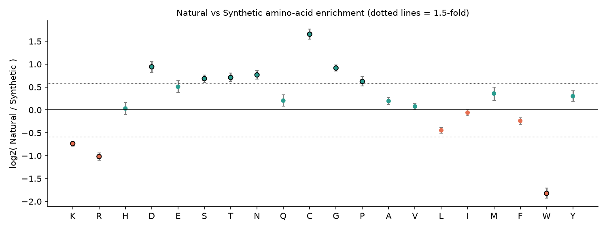

# DBAASP comparative study: what makes antimicrobial peptides differ?

A small, beginner-level comparative study of antimicrobial peptides from the DBAASP database. It asks whether simple features of a peptide (length, charge, hydrophobicity, amino-acid makeup) differ between groups of peptides. Near-identical peptides are removed with **CD-HIT at 90% identity** first, and amino-acid differences are measured as **enrichment against a background population**.

## Questions

1. **Q1 – Natural vs Synthetic:** how do they differ in length, charge and amino-acid composition?
2. **Q2 – Targets:** how do peptides that act on different organisms (Gram+, Gram-, fungi, virus, cancer) differ?
3. **Q3 – Mammalian cells:** do peptides active on mammalian cells (cytotoxic) look different from the rest?
4. **Enrichment:** which amino acids are over- or under-represented in each group compared with the background?

## The data

The `by_*/` folders and `manifest.csv` are slices of **one master table** of about 25,500 peptide records (`dbaasp_datasets_corrected.zip` holds the same files). The slices overlap, so they are not independent datasets. `by_origin/` (Natural + Synthetic) covers every peptide exactly once, so the analysis is built from it.

## Repository layout

| Path | What it holds |
|---|---|
| `by_origin/`, `by_domain/`, `by_kingdom/`, `by_length_class/`, `by_target_group/`, `by_target_object/` | raw slices of the master table |
| `notebooks/01_clean.ipynb` | cleaning: raw table → one clean table |
| `notebooks/02_redundancy.ipynb` | CD-HIT (90% identity) → non-redundant representatives |
| `notebooks/03_features.ipynb` | per-peptide features |
| `notebooks/04_compare.ipynb` | statistical comparison (Q1–Q3), figures, findings |
| `notebooks/05_enrichment.ipynb` | amino-acid enrichment against a background population |
| `results/` | `clean_peptides.csv`, `clean_peptides_clustered.csv`, `peptide_features.csv`, the `comparison_*.csv` and `enrichment_*.csv` tables, and the CD-HIT files in `results/cdhit/` |
| `figures/` | all figures used below |

To reproduce (Python 3, `pip install -r requirements.txt`) you also need the **CD-HIT** program (`sudo apt install cd-hit` or `conda install -c bioconda cd-hit`). Run the notebooks in order, each from inside the `notebooks/` folder:

```bash
cd notebooks
jupyter nbconvert --to notebook --execute --inplace 01_clean.ipynb 02_redundancy.ipynb 03_features.ipynb 04_compare.ipynb 05_enrichment.ipynb
```

## Method

**Cleaning** (`01_clean.ipynb`) – 25,542 raw rows become 18,196 peptides:

| Step | Rows left | Removed |
|---|---|---|
| Raw (Natural + Synthetic) | 25,542 | – |
| Drop exact duplicate rows | 23,542 | 2,000 |
| Keep monomers only (multimers hold several sequences per row) | 22,907 | 635 |
| Drop sequences with `X` (unknown residue) | 18,275 | 4,632 |
| Drop length < 2 | 18,196 | 79 |

Lower-case (D-amino acid) letters were converted to upper case, with a `has_D_aa` flag kept.

**Redundancy removal** (`02_redundancy.ipynb`) – CD-HIT 4.8.1 with `-c 0.9 -n 5 -l 4` clusters peptides that are ≥ 90% identical and keeps the longest one of each cluster (the *representative*). Peptides shorter than 5 residues cannot be clustered with word size 5, so only identical sequences were merged for them (for peptides of up to 9 residues, 90% identity already means identical). Natural and synthetic peptides were clustered together; only 5% of clusters contain both origins.

| | Before | After (representatives) | Kept |
|---|---|---|---|
| Natural | 3,239 | 2,308 | 71% |
| Synthetic | 14,957 | 7,314 | 49% |
| Total | 18,196 | 9,622 | 53% |

Synthetic entries are far more redundant (many single-residue variants of the same design). **All analyses below use the 9,622 non-redundant peptides.**


**Features** (`03_features.ipynb`) – length; net charge = (K + R) − (D + E); charge per residue (net charge ÷ length); hydrophobic fraction (share of A, V, L, I, M, F, W); and the percentage of each of the 20 amino acids.

**Statistics** (`04_compare.ipynb`) – the features are not normally distributed, so rank-based tests are used: Mann-Whitney U for two groups, Kruskal-Wallis for more than two. With thousands of peptides almost every p-value is tiny, so the results are judged by an **effect size, Cliff's delta (δ)**: 0 means no difference, ±1 means the groups do not overlap. Rough labels: |δ| < 0.15 negligible, < 0.33 small, < 0.47 medium, otherwise large. Bonferroni correction is used for the pairwise group comparisons.

For Q2, target groups overlap (one peptide can hit Gram+, Gram- and fungi), so only peptides whose targets are *exactly* one of six sets are used: Gram+ only, Gram- only, Gram+ & Gram-, Fungus only, Virus only, Cancer only.

**Amino-acid enrichment** (`05_enrichment.ipynb`) – for each group (Natural, Synthetic, Gram+, Gram-, Fungus, Cancer, Virus, Mammalian-active) the **background population** is all other non-redundant peptides, i.e. those outside the group. For each amino acid, enrichment = log2( share of the group's residues ÷ share of the background's residues ): 0 = as common as in the background, +1 = twice as common. Significance uses Fisher's exact test on residue counts with Benjamini-Hochberg correction, plus a bootstrap over peptides (residues in one peptide are not independent) for a 95% interval. An amino acid is called enriched or depleted only if q < 0.05, the bootstrap interval excludes 0 and the change is at least 1.5-fold. As a negative control, 200 random groups gave no calls at all.

## Results

### Q1 – Natural vs Synthetic (2,308 vs 7,314 non-redundant peptides)

| Feature | Natural (median) | Synthetic (median) | δ | Effect |
|---|---|---|---|---|
| Length (residues) | 25 | 15 | +0.47 | medium |
| Net charge | 3 | 4 | −0.26 | small |
| **Charge per residue** | 0.10 | 0.29 | **−0.60** | **large** |
| Hydrophobic fraction | 0.41 | 0.46 | −0.16 | small |


* **Charge per residue is the clearest difference**, and it is robust: it holds among short (10–24 aa) peptides only (δ = −0.66), without D-amino-acid peptides (δ = −0.59), and is identical before and after redundancy removal (δ = −0.60).
* **Hydrophobic fraction is a weaker, length-dependent difference.** It is small overall (and looked negligible, δ = −0.08, before redundancy removal), and among short peptides the direction flips (natural 0.52 vs synthetic 0.46, δ = +0.14).
* **Targets:** natural peptides are reported active against fungi much more often (54% vs 22%) and against parasites (5.0% vs 0.9%); Gram+ activity is 87% vs 78%.


* **PCA:** the two groups overlap heavily (PC1 and PC2 explain 14% and 10% of the variance). The features do not separate them cleanly.


### Amino-acid enrichment

Natural peptides relative to synthetic peptides (each is the other's background, so the results are mirror images):

| More common in **natural** peptides | More common in **synthetic** peptides |
|---|---|
| C (6.6% vs 2.1% of residues, +1.66 log2), D (+0.94), G (11.1% vs 5.9%, +0.92), N (+0.77), T (+0.71), S (+0.68), P (+0.62) | W (5.7% vs 1.6%, 3.5-fold), R (11.8% vs 5.8%, 2.0-fold), K (16.6% vs 10.0%, 1.7-fold) |



Synthetic peptides show the classic designed "cationic and tryptophan-rich" pattern; natural peptides are richer in cysteine (disulfide-bonded scaffolds), glycine and small polar residues.

All groups (log2 enrichment against the peptides outside the group; a star marks amino acids meeting the full rule):


| Group | Most enriched | Most depleted |
|---|---|---|
| Virus (n = 654) | E (+1.77), Q (+1.18), D (+1.12) | P (−0.77), K (−0.68), R (−0.65) |
| Fungus (n = 2,859) | C (+0.70) | W (−0.75) |
| Gram+ (n = 7,603) | – | E (−0.96), Q (−0.63) |
| Gram- (n = 7,779) | – | E (−1.07), D (−0.62) |
| Mammalian-active (n = 5,327) | – | E (−0.86), Y (−0.66), C (−0.65), D (−0.64) |
| Cancer (n = 1,813) | – | – |

Virus-active peptides are acidic and polar rather than cationic. Gram+ and Gram- results partly mirror this, because those two groups are 79–81% of all peptides and their background is mostly virus- and other non-antibacterial peptides. No amino acid reaches a 1.5-fold change for Cancer.

### Q2 – Peptides with different targets

| Group | n | Median length | Median net charge | Median charge per residue | Median hydrophobic fraction |
|---|---|---|---|---|---|
| Gram+ only | 412 | 13 | 3 | 0.21 | 0.50 |
| Gram- only | 294 | 17 | 5 | 0.27 | 0.36 |
| Gram+ & Gram- | 1,598 | 18 | 4 | 0.19 | 0.43 |
| Fungus only | 178 | 12 | 3 | 0.17 | 0.37 |
| Virus only | 363 | 18 | 0 | 0.00 | 0.42 |
| Cancer only | 121 | 8 | 0 | 0.00 | 0.50 |


* The groups differ mainly in **charge** (Kruskal-Wallis effect size ε² ≈ 0.17 for net charge and charge per residue, against 0.05 for length and hydrophobic fraction).
* Virus-only and Cancer-only peptides have median net charge 0, against 3–5 for the antibacterial and antifungal groups (charge δ between +0.56 and +0.77).
* Gram- only peptides have the highest charge per residue and the lowest hydrophobic fraction; Gram+ only peptides are more hydrophobic (δ = +0.40 against Gram- only).
* **Check:** the origin mix differs by group (Virus-only is 1% natural, Cancer-only 52%). Repeating the medians for synthetic peptides only gives the same picture, so this is not only an origin effect.


### Q3 – Mammalian-cell activity

`is_mammalian_cell = 1` means DBAASP lists mammalian cells among the peptide's targets (5,327 peptides); the rest are "not reported" (4,194).

| Feature | Mammalian-active | Not reported | δ | Effect |
|---|---|---|---|---|
| Length | 16 | 17 | −0.03 | negligible |
| Net charge | 4 | 3 | +0.18 | small |
| Charge per residue | 0.25 | 0.17 | +0.22 | small |
| Hydrophobic fraction | 0.46 | 0.43 | +0.14 | negligible |


Mammalian-active peptides are somewhat more charged, and the charge effect appears within synthetic and within natural peptides separately. In the enrichment analysis they are depleted in acidic residues (E, D). The overlap is large, so charge alone would not predict mammalian activity well.

## Limitations

* The peptides are not a random sample of all peptides; they are the ones researchers chose to test and report in DBAASP.
* CD-HIT keeps the longest sequence of each cluster and merges fragments into longer peptides (about half of the removed peptides were shorter than 90% of their representative), so the non-redundant set is slightly biased towards longer peptides. Peptides shorter than 5 residues were only merged when identical.
* About 20% of monomer sequences were dropped for containing `X`; the rate was similar for both origins (19% natural, 21% synthetic).
* Enrichment uses pooled residues, is not corrected for length or residue position, and depends on the chosen background. For large or overlapping groups (Gram+, Gram-) the background is a small, specific subset, so results mean "group vs the rest of DBAASP". No proteome-wide reference (for example Swiss-Prot frequencies) was used as an extra background.
* Q2 keeps only peptides with exactly one target set (or the Gram+ & Gram- pair), which leaves small groups for some targets (Cancer only: 121 peptides, 58 of them synthetic).
* In Q3, "not reported" is not the same as "not toxic": a peptide may never have been tested on mammalian cells.
* The features are simple sequence summaries (no 3D structure, no terminal modifications), and the hydrophobic fraction depends on which residues are counted as hydrophobic.
* These are associations in a curated database, not evidence that a feature *causes* a difference in activity.

## License

MIT, see `LICENSE`.
