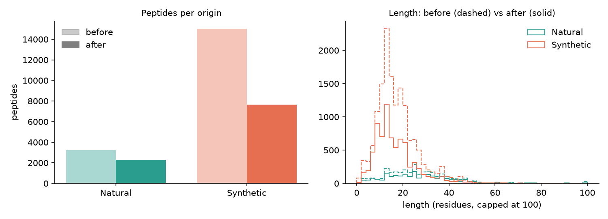
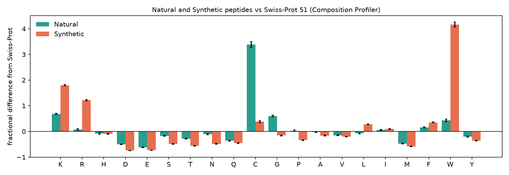
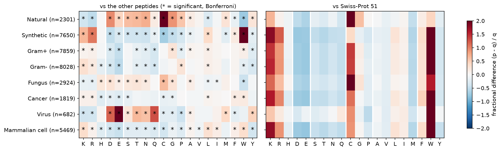

# DBAASP comparative study: what makes antimicrobial peptides differ?

A small, beginner-level comparative study of peptides from the DBAASP database. It asks whether simple features of a peptide (length, charge, hydropathy, amino-acid makeup) differ between groups of peptides. Near-identical peptides are removed with **CD-HIT at 90% identity** first, and amino-acid differences are measured as **enrichment against background populations**.

Every method below is tied to a published source, cited next to the code that uses it (in the notebooks) and listed under [References](#references). Where a value is a study choice with no published source, it is listed under [Choices without a citation](#choices-without-a-citation).

## Questions

1. **Q1 – Natural vs Synthetic:** how do they differ in length, charge and hydropathy?
2. **Q2 – Target groups:** how do peptides listed with different target groups (Gram+, Gram-, fungi, virus, cancer) differ?
3. **Q3 – Mammalian cells:** do peptides listed with mammalian cells as a target look different from the rest?
4. **Enrichment:** which amino acids are over- or under-represented in each group compared with a background?

## The data

The `by_*/` folders and `manifest.csv` are slices of **one master table** of about 25,500 records from **DBAASP**, a curated database of peptides tested for antimicrobial and cytotoxic activity (Pirtskhalava et al. 2016, 2021). The slices overlap, so they are not independent datasets. `by_origin/` (Natural + Synthetic) covers every peptide exactly once, so the analysis is built from it.

**Wording:** DBAASP includes peptides that were tested "regardless of whether the peptides are determined to be active or inactive" (Pirtskhalava et al. 2021). We could not check how the `TARGET GROUP` field treats inactive peptides, so we say a peptide is **listed with** a target group, never "active against" it.

## Repository layout

| Path | What it holds |
|---|---|
| `by_origin/`, `by_domain/`, `by_kingdom/`, `by_length_class/`, `by_target_group/`, `by_target_object/` | raw slices of the master table |
| `notebooks/01_clean.ipynb` | cleaning: raw table → one clean table |
| `notebooks/02_redundancy.ipynb` | CD-HIT (90% identity) → non-redundant representatives |
| `notebooks/03_features.ipynb` | per-peptide features (Biopython) |
| `notebooks/04_compare.ipynb` | statistical comparison (Q1–Q3), figures, findings |
| `notebooks/05_enrichment.ipynb` | amino-acid enrichment (Composition Profiler method) |
| `results/` | `clean_peptides.csv`, `clean_peptides_clustered.csv`, `peptide_features.csv`, the `comparison_*.csv` and `enrichment_*.csv` tables, and the CD-HIT files in `results/cdhit/` |
| `figures/` | all figures used below |

To reproduce (Python 3, `pip install -r requirements.txt`) you also need the **CD-HIT** program (`sudo apt install cd-hit` or `conda install -c bioconda cd-hit`). Run the notebooks in order, each from inside the `notebooks/` folder:

```bash
cd notebooks
jupyter nbconvert --to notebook --execute --inplace 01_clean.ipynb 02_redundancy.ipynb 03_features.ipynb 04_compare.ipynb 05_enrichment.ipynb
```

## Method

**Cleaning** (`01_clean.ipynb`) – 25,542 raw rows become 18,275 peptides:

| Step | Rows left | Removed | Why |
|---|---|---|---|
| Raw (Natural + Synthetic) | 25,542 | – | |
| Drop exact duplicate rows | 23,542 | 2,000 | DBAASP gives each chemically distinct peptide its own record, so a repeated row is a copy (Pirtskhalava et al. 2016) |
| Keep monomers only | 22,907 | 635 | multimer / multi-peptide records hold several chains per sequence; DBAASP's own modelling pipeline is also restricted to monomers (Pirtskhalava et al. 2021) |
| Drop sequences with `X`/`x` | 18,275 | 4,632 | `X`/`x` marks an unusual or modified amino acid (Pirtskhalava et al. 2016), for which charge, hydropathy and composition are undefined |

In DBAASP sequences lower-case letters are D-stereoisomers (Pirtskhalava et al. 2016); we convert them to upper case and keep a `has_D_aa` flag.

**Redundancy removal** (`02_redundancy.ipynb`) – DBAASP notes that "many of the peptides in the database are derivatives" (Pirtskhalava et al. 2016), so near-identical peptides would be counted many times. CD-HIT (Li & Godzik 2006; Fu et al. 2012) clusters sequences at ≥ 90% identity and keeps the longest of each cluster; filtering AMP data with CD-HIT is common (for example Veltri et al. 2018). Settings: `-c 0.9` (the study's protocol, also CD-HIT's default), `-n 5` (CD-HIT user's guide: "-n 5 for thresholds 0.7 ~ 1.0"), `-l 9` (CD-HIT drops sequences at or below `-l`, so this keeps peptides of 10 residues and longer). Peptides shorter than 10 residues are merged only when their sequences are identical, because for up to 9 residues 90% identity already means identical.

| | Before | After (representatives) | Kept |
|---|---|---|---|
| Natural | 3,239 | 2,301 | 71% |
| Synthetic | 15,036 | 7,650 | 51% |
| Total | 18,275 | 9,951 | 54% |

Only 5% of clusters contain both natural and synthetic peptides. **All analyses below use the 9,951 non-redundant peptides.**



**Features** (`03_features.ipynb`), computed with Biopython (Cock et al. 2009): **net charge at pH 7** from the pK values of Bjellqvist et al. (1993, 1994); **charge per residue** = net charge ÷ length (a normalised net charge, cf. Uversky et al. 2000); **mean hydropathy (GRAVY)** = average Kyte-Doolittle value (Kyte & Doolittle 1982); length; and the percentage of each of the 20 amino acids.

**Statistics** (`04_compare.ipynb`) – rank-based tests: **Mann-Whitney U** for two independent groups (Mann & Whitney 1947) and **Kruskal-Wallis** for more than two (Kruskal & Wallis 1952). Effect sizes follow Fiel Peres (2025): **Cliff's delta δ** (= 2 × Vargha-Delaney A − 1; 0 = no difference, ±1 = no overlap) with the labels |δ| ≥ 0.11 small, ≥ 0.28 medium, ≥ 0.43 large (heuristics; below 0.11 we write "negligible"), and **ordinal eta-squared** η²ₕ = (H − k + 1)/(N − k) for Kruskal-Wallis (small ≥ 0.01, medium ≥ 0.06, large ≥ 0.14), followed by pairwise Cliff's delta. Effect sizes are reported because p-values depend strongly on sample size (Fiel Peres 2025). For Q2, groups must be independent, so only peptides listed with *exactly* one of six target sets are used: Gram+ only, Gram- only, Gram+ & Gram-, Fungus only, Virus only, Cancer only.

**Amino-acid enrichment** (`05_enrichment.ipynb`) follows **Composition Profiler** (Vacic et al. 2007): the *fractional difference* h = (p − q) / q between a group's residue frequencies p and a background's q; p and q are estimated by bootstrapping whole peptides (1,000 replicates), with the paper's error bar; significance is a two-sample t-test on binary residue indicators with Bonferroni correction (α = 0.05 / 20). Two backgrounds are used: **(1) the other non-redundant peptides** outside the group (the paper lists "a group of proteins with a contrasting functional annotation" as a valid background) and **(2) Swiss-Prot 51**, whose composition is taken from Table 1 of the same paper. DBAASP's own composition tool compares peptides with UniProt in the same spirit (Pirtskhalava et al. 2016, 2021).

## Results

### Q1 – Natural vs Synthetic (2,301 vs 7,650 non-redundant peptides)

| Feature | Natural (median) | Synthetic (median) | δ | Effect |
|---|---|---|---|---|
| Length (residues) | 25 | 14 | +0.49 | large |
| Net charge (pH 7) | 2.7 | 3.8 | −0.26 | small |
| **Charge per residue** | 0.09 | 0.28 | **−0.59** | **large** |
| Mean hydropathy (GRAVY) | 0.17 | −0.35 | +0.32 | medium |


* **Charge per residue is the clearest difference** and is robust: among short (10–24 aa) peptides only δ = −0.66, without D-amino-acid peptides δ = −0.58, and the same before and after redundancy removal (δ = −0.59).
* **GRAVY:** natural peptides are less hydrophilic (δ = +0.32; +0.51 among short peptides). In the Kyte-Doolittle scale lysine and arginine are among the most hydrophilic residues, so K/R-rich synthetic peptides get a low GRAVY; charge and GRAVY are therefore not independent.
* **Listed target groups:** natural peptides are listed with fungi much more often (54% vs 22%) and with parasites (5.0% vs 0.9%); Gram+ 87% vs 78%.


### Amino-acid enrichment

**Check against the literature.** Against Swiss-Prot, natural peptides have more cysteine (h = +3.38), lysine (+0.68) and glycine (+0.60) and less aspartate (−0.50) and glutamate (−0.62); synthetic peptides have more tryptophan (+4.16), lysine (+1.80) and arginine (+1.22) and less aspartate and glutamate. DBAASP v2 reports the same qualitative picture for its ribosomal and synthetic peptides compared with UniProt (Pirtskhalava et al. 2016).



**Natural relative to Synthetic** (each is the other's background; h depends on which group is the background):

| Higher in natural peptides | Higher in synthetic peptides |
|---|---|
| C (6.6% vs 2.1% of residues, h = +2.17), D (+0.95), G (11.1% vs 5.9%, +0.90), N (+0.72), T (+0.65), S (+0.62), P (+0.55) | W (5.8% vs 1.6%, 3.6 times as common), R (12.0% vs 5.8%), K (16.6% vs 10.0%) |

Synthetic peptides show the "cationic, tryptophan-rich" pattern of designed peptides; natural peptides are richer in cysteine (disulfide-bonded scaffolds), glycine and small polar residues.

**All groups** (left: against the other peptides, star = significant after Bonferroni; right: against Swiss-Prot):



| Group (n peptides) | Largest positive h vs other peptides | Largest negative h |
|---|---|---|
| Virus (682) | E (+2.42), Q (+1.29), D (+1.18) | P (-0.41), K (-0.38), R (-0.36) |
| Fungus (2,924) | C (+0.63), D (+0.28), G (+0.27) | W (-0.42), R (-0.16), K (-0.15) |
| Gram+ (7,859) | G (+0.25), L (+0.12), W (+0.12) | E (-0.48), Q (-0.35), D (-0.30) |
| Gram- (8,028) | K (+0.32), P (+0.25), R (+0.18) | E (-0.52), D (-0.35), Q (-0.33) |
| Mammalian cell (5,469) | K (+0.35), W (+0.34), L (+0.30) | E (-0.45), Y (-0.37), D (-0.36) |
| Cancer (1,819) | W (+0.19), F (+0.17), R (+0.11) | E (-0.25), H (-0.24), D (-0.17) |

(The three largest Bonferroni-significant changes in each direction, copied from `results/enrichment_top.csv`. With thousands of residues almost every amino acid is "significant", so look at the size of h; for Gram+, Gram-, Fungus, Cancer and Mammalian cell the changes are modest, mostly below 0.5.) Peptides listed with viruses are acidic and polar rather than cationic. The Gram+/Gram- pattern partly mirrors this because those groups are about 80% of all peptides and their "other peptides" background is small and mixed. Against Swiss-Prot, lysine, arginine and tryptophan are more common and aspartate and glutamate less common in essentially every group.

### Q2 – Peptides listed with different target groups

| Group | n | Median length | Median net charge | Median charge per residue | Median GRAVY |
|---|---|---|---|---|---|
| Gram+ only | 435 | 13 | 2.8 | 0.19 | −0.27 |
| Gram- only | 308 | 16 | 3.9 | 0.27 | −0.93 |
| Gram+ & Gram- | 1,673 | 18 | 3.0 | 0.18 | −0.18 |
| Fungus only | 192 | 12 | 2.9 | 0.17 | −0.68 |
| Virus only | 385 | 18 | −0.2 | −0.01 | −0.13 |
| Cancer only | 122 | 8 | −0.2 | −0.02 | +0.87 |


* Groups differ most in **charge** (Kruskal-Wallis η²ₕ = 0.17, large, for net charge and charge per residue; 0.06 medium for GRAVY; 0.05 small for length).
* Virus-only and Cancer-only peptides have a median net charge of about 0, against 2.8–3.9 for the antibacterial and antifungal groups (pairwise charge-per-residue δ +0.52 to +0.79).
* Cancer-only peptides are the shortest and the only group with a positive median GRAVY, but the group is small.
* **Check:** the origin mix differs by group (Virus-only is 1% natural, Cancer-only 53%). Repeating the medians for synthetic peptides only gives the same picture, so this is not only an origin effect.


### Q3 – Peptides listed with mammalian cells

5,469 peptides are listed with mammalian cells as a target, 4,355 are not. DBAASP collects hemolytic and cytotoxicity data (Pirtskhalava et al. 2016), but "listed" does not mean "toxic".

| Feature | Listed | Not listed | δ | Effect |
|---|---|---|---|---|
| Length | 16 | 17 | −0.01 | negligible |
| Net charge | 3.8 | 2.8 | +0.19 | small |
| Charge per residue | 0.25 | 0.15 | +0.23 | small |
| GRAVY | −0.20 | −0.24 | +0.01 | negligible |


The charge effects also appear within synthetic and within natural peptides separately. In the enrichment analysis, peptides listed with mammalian cells are lower in acidic residues (E, D). The overlap is large, so charge alone would not predict it well.

## Choices without a citation

These are parameters or design decisions we could not tie to a source; they are stated so that nothing is hidden:

* the **90% identity** threshold (the study protocol given for this project; it is also CD-HIT's default);
* **pH 7.0** for the net charge (a parameter of the cited Biopython/Bjellqvist method);
* **1,000 bootstrap replicates** (Composition Profiler uses many more for its standard datasets; we chose a number that runs quickly);
* the **exclusive target groups** (a design that follows from the independence assumption of the tests) and the **"Short (10–24 aa)"** length class used in one sensitivity check (taken from this repository's `by_length_class` files);
* **cleaning by exact duplicate rows** (justified by DBAASP's per-structure records, but the duplicate rows themselves come from the repository files).

Methods we tried earlier and **removed because we could not verify a source**: a fixed 1.5-fold cut-off for calling enrichment, a random-group negative control, Benjamini-Hochberg/Fisher tests, a PCA plot, a hand-made "hydrophobic fraction", a hand-made "K + R − D − E" charge, and a "length < 2" filter.

## Limitations

* The peptides are not a random sample of all peptides; they are the ones researchers chose to test and report in DBAASP.
* CD-HIT keeps the longest sequence of each cluster and merges shorter peptides that match part of a longer one (about 42% of the removed peptides were shorter than 90% of their representative), so the non-redundant set leans towards longer peptides. Peptides under 10 residues were only merged when identical.
* About 20% of monomer sequences were dropped for containing `X`; the rate was similar for both origins (19% natural, 21% synthetic).
* Net charge and GRAVY are calculated from the sequence alone: terminal modifications (for example C-terminal amidation, which can change activity a lot; Pirtskhalava et al. 2016) and D-amino-acid stereochemistry are ignored.
* The enrichment t-test treats every residue as independent (as in the original method), so p-values are optimistic; composition is pooled over residues without correcting for length; Swiss-Prot 51 is an old, rough reference and comparisons with UniProt are most meaningful for ribosomal peptides (Pirtskhalava et al. 2021).
* Q2 keeps only peptides with exactly one listed target set (or the Gram+ & Gram- pair), which leaves small groups (Cancer only: 122 peptides, 58 of them synthetic).
* Target groups mean "listed with", not "active against".
* The effect-size labels are heuristics (Fiel Peres 2025).
* These are associations in a curated database, not evidence that a feature *causes* a difference in activity.

## References

Each reference was looked up before being cited; the last column says how.

| Short name | Reference | Checked by |
|---|---|---|
| Pirtskhalava et al. 2016 | Pirtskhalava M, et al. DBAASP v.2: an enhanced database of structure and antimicrobial/cytotoxic activity of natural and synthetic peptides. *Nucleic Acids Res* 44(D1):D1104-D1112. [doi:10.1093/nar/gkv1174](https://doi.org/10.1093/nar/gkv1174) (PMID 26578581) | PubMed record; full text read |
| Pirtskhalava et al. 2021 | Pirtskhalava M, et al. DBAASP v3: database of antimicrobial/cytotoxic activity and structure of peptides as a resource for development of new therapeutics. *Nucleic Acids Res* 49(D1):D288-D297. [doi:10.1093/nar/gkaa991](https://doi.org/10.1093/nar/gkaa991) (PMID 33151284) | PubMed record; full text read |
| Li & Godzik 2006 | Li W, Godzik A. Cd-hit: a fast program for clustering and comparing large sets of protein or nucleotide sequences. *Bioinformatics* 22(13):1658-1659. [doi:10.1093/bioinformatics/btl158](https://doi.org/10.1093/bioinformatics/btl158) (PMID 16731699) | PubMed record (abstract) |
| Fu et al. 2012 | Fu L, Niu B, Zhu Z, Wu S, Li W. CD-HIT: accelerated for clustering the next-generation sequencing data. *Bioinformatics* 28(23):3150-3152. [doi:10.1093/bioinformatics/bts565](https://doi.org/10.1093/bioinformatics/bts565) (PMID 23060610) | PubMed record (abstract) |
| CD-HIT user's guide | CD-HIT user's guide: [github.com/weizhongli/cdhit/wiki/3.-User's-Guide](https://github.com/weizhongli/cdhit/wiki/3.-User's-Guide) (word-size table, `-l`); and `cd-hit -h` of version 4.8.1 | fetched 2026-09-29; help text run locally |
| Veltri et al. 2018 | Veltri D, Kamath U, Shehu A. Deep learning improves antimicrobial peptide recognition. *Bioinformatics* 34(16):2740-2747. [doi:10.1093/bioinformatics/bty179](https://doi.org/10.1093/bioinformatics/bty179) (PMID 29590297) | PubMed record; full text read (used only for "AMP data are filtered with CD-HIT"; the identity value was not legible in the text we could retrieve) |
| Cock et al. 2009 | Cock PJA, et al. Biopython: freely available Python tools for computational molecular biology and bioinformatics. *Bioinformatics* 25(11):1422-1423. [doi:10.1093/bioinformatics/btp163](https://doi.org/10.1093/bioinformatics/btp163) (PMID 19304878) | PubMed record; Biopython 1.88 documentation of `gravy` and `charge_at_pH` read locally |
| Kyte & Doolittle 1982 | Kyte J, Doolittle RF. A simple method for displaying the hydropathic character of a protein. *J Mol Biol* 157(1):105-132. [doi:10.1016/0022-2836(82)90515-0](https://doi.org/10.1016/0022-2836(82)90515-0) (PMID 7108955) | PubMed record; cited by the Biopython `gravy` documentation |
| Bjellqvist et al. 1993 | Bjellqvist B, et al. The focusing positions of polypeptides in immobilized pH gradients can be predicted from their amino acid sequences. *Electrophoresis* 14(10):1023-1031. [doi:10.1002/elps.11501401163](https://doi.org/10.1002/elps.11501401163) (PMID 8125050) | PubMed record; cited by the Biopython `IsoelectricPoint` module |
| Bjellqvist et al. 1994 | Bjellqvist B, Basse B, Olsen E, Celis JE. Reference points for comparisons of two-dimensional maps of proteins from different human cell types defined in a pH scale where isoelectric points correlate with polypeptide compositions. *Electrophoresis* 15(3-4):529-539. [doi:10.1002/elps.1150150171](https://doi.org/10.1002/elps.1150150171) (PMID 8055880) | PubMed record; cited by the Biopython `IsoelectricPoint` module |
| Uversky et al. 2000 | Uversky VN, Gillespie JR, Fink AL. Why are "natively unfolded" proteins unstructured under physiologic conditions? *Proteins* 41(3):415-427. [doi:10.1002/1097-0134(20001115)41:3<415::aid-prot130>3.0.co;2-7](https://doi.org/10.1002/1097-0134(20001115)41:3%3C415::aid-prot130%3E3.0.co;2-7) (PMID 11025552) | PubMed record (abstract); used only for the idea of a *normalised* net charge |
| Vacic et al. 2007 | Vacic V, Uversky VN, Dunker AK, Lonardi S. Composition Profiler: a tool for discovery and visualization of amino acid composition differences. *BMC Bioinformatics* 8:211. [doi:10.1186/1471-2105-8-211](https://doi.org/10.1186/1471-2105-8-211) (PMID 17578581) | PubMed record; full text read (methods and Table 1) |
| Fiel Peres 2025 | Fiel Peres F. Effect sizes for nonparametric tests. *Biochem Med (Zagreb)* 36(1):010101. [doi:10.11613/BM.2026.010101](https://doi.org/10.11613/BM.2026.010101) (PMID 41399660) | PubMed record; full text read (formulas and thresholds) |
| Mann & Whitney 1947 | Mann HB, Whitney DR. On a test of whether one of two random variables is stochastically larger than the other. *Ann Math Stat* 18(1):50-60 | as cited in the SciPy documentation of `mannwhitneyu` (original not opened) |
| Kruskal & Wallis 1952 | Kruskal WH, Wallis WA. Use of ranks in one-criterion variance analysis. *J Am Stat Assoc* 47(260):583-621 | as cited in the SciPy documentation of `kruskal` (original not opened) |

## License

MIT, see `LICENSE`.
